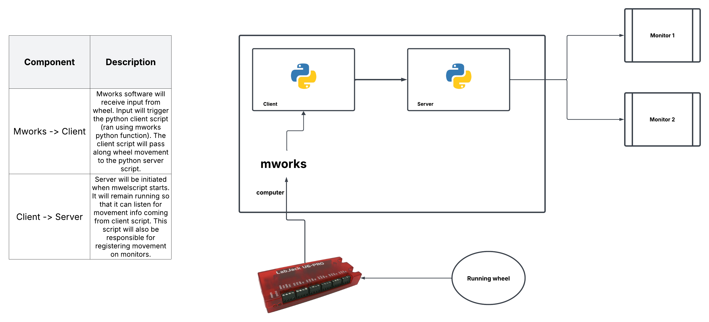

# vision-cerebellum-sensory-error-vr

#### This repo currently contains mworks and python code used for replicating the Leinweber et al. (2014) sine grating sample code. Soon the Fiser et al. (2016) VR paradigm will be used instead of the sine grating example environment. 

#### Summary of process: IO device sense input to mworks. The mworks client activates server.py when the mworks_input.mwel file is loaded. This displays the panda3D enviornment. server.py will be listening for client.py, which is called when mworks receives input. When server.py is sent a command from mworks, the commands are loaded into a queue which are then implemented in server.py.  

#### Currently uses python version 2.7.16 
